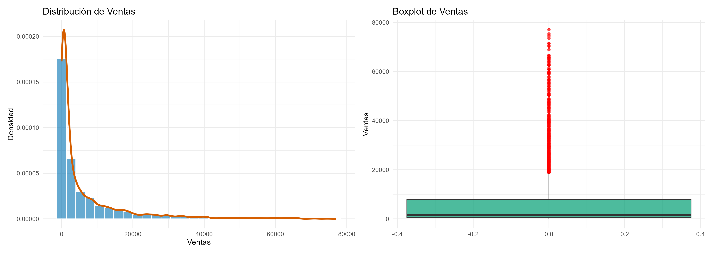
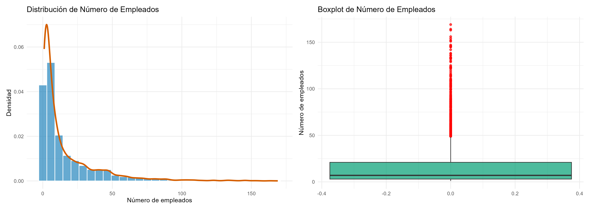
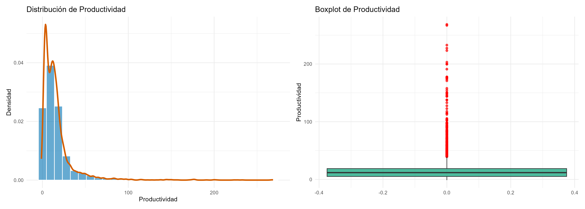

# Introducción

Este informe tiene como objetivo analizar el comportamiento de las ventas de dispositivos móviles y electrónicos de una franquicia que opera en diferentes provincias de España. A partir de los datos disponibles, se examinan tres variables clave: Ventas, Número de empleados y Productividad, con el fin de comprender mejor su distribución, relación entre ellas y posibles patrones significativos.

El análisis comienza con una exploración descriptiva detallada, incluyendo medidas estadísticas como la media, mediana, desviación estándar, asimetría y curtosis. Para complementar esta información numérica, se utilizan gráficos como histogramas, boxplots, gráficos de densidad y QQ-plots, que ayudan a visualizar la forma y dispersión de los datos.

A continuación, se construye una matriz de correlaciones para evaluar la fuerza y dirección de las relaciones lineales entre las variables numéricas. También se crean intervalos para clasificar las ventas en rangos homogéneos y se agrupan las empresas según su tamaño (micro, pequeña, mediana o grande) en función del número de empleados. A partir de estas agrupaciones, se elabora una tabla de contingencia que permite observar la distribución conjunta y explorar si existe una relación significativa entre ambas variables.

Por último, se desarrollan modelos de regresión lineal simple y múltiple para estudiar cómo varían las ventas en función de otras variables. Estos modelos permiten identificar relaciones relevantes y estimar el impacto de cada factor sobre el nivel de ventas. Además, se lleva a cabo un análisis inferencial para contrastar si existen diferencias significativas en las ventas entre las provincias de Madrid y Barcelona.

Todo el análisis se ha realizado en R, con un enfoque estructurado, utilizando gráficos y herramientas estadísticas para obtener conclusiones claras y fundamentadas.

```{r, include=FALSE}
library(ggplot2)
library(dplyr)
library(car)
library(corrplot)
library(moments)
library(broom)
library(lawstat)
library(readxl)
library(psych)
library(tidyverse)
library(patchwork)
library(knitr)
library(dplyr)
library(kableExtra)
```
```{r, include=FALSE}
knitr::opts_chunk$set(echo=FALSE, message=FALSE, warning=FALSE)
set.seed(123)
source("main R.R")
group_rows <- kableExtra::group_rows

```

# Análisis descriptivo de las variables numéricas
En esta sección se analizan estadísticamente las tres variables principales del estudio: **VENTAS**, **NÚMERO DE EMPLEADOS** y **PRODUCTIVIDAD**. Se calculan medidas de tendencia central, dispersión y forma, y se visualizan sus distribuciones mediante histogramas, boxplots, QQ-plots y violin plots. Posteriormente, se estudia la relación lineal entre estas variables mediante una matriz de correlaciones.


```{r}
bind_rows(estadisticos_ventas,
          estadisticos_empleados,
          estadisticos_productividad) %>%
  kable(caption = "Estadísticos descriptivos de Ventas, Empleados y Productividad",
        digits = 2) %>%
  kable_styling(full_width = F, position = "center")

```
A continuación se presentan las principales medidas descriptivas para las variables Ventas, Número de empleados y Productividad:

Las tres variables muestran una alta variabilidad entre provincias. En todos los casos, la diferencia entre media y mediana, junto con las elevadas desviaciones estándar, sugiere la existencia de distribuciones asimétricas y con valores extremos. Ventas y Número de empleados tienden a concentrarse en niveles bajos, mientras que Productividad presenta una dispersión aún mayor, con algunos casos especialmente elevados que afectan la media.

Además, ninguna de las variables sigue una distribución normal, tal como se confirma tanto por los estadísticos de asimetría y curtosis como por las representaciones gráficas correspondientes. Esta falta de normalidad deberá ser tenida en cuenta en los análisis posteriores, especialmente en la aplicación de métodos inferenciales o de regresión.



**Análisis de Ventas**  
La variable **Ventas** presenta una distribución claramente **asimétrica hacia la derecha**: la mayoría de provincias se concentran en niveles bajos de facturación, mientras que unas pocas alcanzan cifras muy elevadas. Este patrón genera una cola larga y explica que la **mediana se sitúe por debajo de la media**. El boxplot confirma la existencia de numerosos **outliers**, lo que pone de manifiesto una fuerte heterogeneidad en los resultados de ventas entre provincias.
  



**Análisis del Número de Empleados**  
El **Número de Empleados** también muestra una **asimetría positiva**, ya que la mayoría de empresas cuentan con plantillas reducidas (micro y pequeñas empresas). La **mediana es baja, en torno a 7 empleados**, y el boxplot refleja la existencia de varias empresas con un número de trabajadores muy superior al resto. Estos casos actúan como **valores atípicos** que elevan la media y evidencian la presencia de algunas franquicias de gran tamaño frente a un sector dominado por negocios pequeños.




**Análisis de la Productividad**  
La **Productividad** es la variable con mayor **dispersión relativa**. Su distribución se concentra en valores bajos, pero con algunos casos extremadamente elevados que generan una cola muy pronunciada hacia la derecha. El boxplot refleja una **mediana cercana a 12**, lo que significa que más de la mitad de las observaciones están por debajo de ese nivel. Los numerosos **outliers** sugieren que existen diferencias muy marcadas en la eficiencia de las empresas según la provincia.


# Matriz de correlaciones

La matriz de correlaciones permite identificar la **intensidad y dirección** de las relaciones lineales entre las distintas variables de la base de datos, tanto de carácter financiero como operativo y estructural.

```{r correlaciones, echo=FALSE, fig.width=8, fig.height=6, message=FALSE, warning=FALSE}
# Seleccionar solo variables numéricas
datos_numericos <- data[sapply(data, is.numeric)]
matriz_correlacion <- cor(datos_numericos, use = "complete.obs")

# Visualización
corrplot::corrplot(
  matriz_correlacion,
  method = "color",
  type   = "upper",
  order  = "hclust",
  addCoef.col = "black",
  tl.cex = 0.7,
  number.cex = 0.6,
  cl.cex = 0.8
)
```
**Interpretación de resultados**

La matriz de correlaciones refleja, en primer lugar, una **relación muy fuerte y positiva entre Ventas y Número de Empleados (r = 0.89)**. Este resultado es coherente, ya que las provincias con mayor plantilla suelen disponer de más capacidad operativa y, en consecuencia, alcanzan cifras de facturación más elevadas.  

Además, aparecen **correlaciones de magnitud moderada** entre Ventas y la **cuota de mercado por provincias (coe, r = 0.53)**, así como con el **número de establecimientos (numest, r = 0.49)**. Ambos indicadores apuntan a que la presencia territorial y la posición relativa en el mercado también guardan relación con el nivel de ventas, aunque con un peso claramente inferior al del tamaño de la plantilla.  

En cambio, la **Productividad (produc)** presenta una **correlación muy débil con las Ventas (r = 0.08)**. Esto indica que la eficiencia media por trabajador no es un factor determinante en la facturación de las empresas de la muestra.  

Si nos fijamos en las **variables financieras**, como la rentabilidad económica (rentabieco), la rentabilidad financiera (rentabifin) o la liquidez (liq), sus coeficientes de correlación con las ventas son prácticamente nulos. Es decir, en este conjunto de datos el volumen de facturación no parece depender directamente de estos indicadores.  

Por otro lado, sí resulta llamativa la **relación negativa entre Endeudamiento (endp) y Rentabilidad Económica (r = –0.50)**, que sugiere que un mayor nivel de apalancamiento suele ir acompañado de menores niveles de rentabilidad.  

En resumen, los resultados apuntan a que las **ventas están explicadas sobre todo por factores estructurales, en especial por el número de empleados**, mientras que la productividad y las variables financieras tienen un papel mucho menos relevante. Este hallazgo justifica pasar al análisis de **modelos de regresión lineal**, tomando a Ventas como variable dependiente y al número de empleados como principal predictor.

# Clasificación y análisis de dependencia categórica

Con el fin de comparar las **ventas** y el **tamaño de las empresas**, se transformaron ambas variables continuas en categorías:

- **Ventas** → se dividieron en intervalos homogéneos según el rango y el tamaño de la muestra.  
- **Número de empleados** → se clasificó en Microempresa (1–9), Pequeña (10–49), Mediana (50–249) y Grande (250+).

A partir de estas transformaciones se construyó una **tabla de contingencia** y se aplicó un **test de independencia χ²**.


```{r}
tabla_empresas <- data_2 %>%
  group_by(CATEGORIA_EMPLEADOS) %>%
  summarise(Total_Empresas = n()) %>%
  arrange(factor(CATEGORIA_EMPLEADOS,
                 levels = c("Microempresa", "Pequeña Empresa", "Mediana Empresa")))

kable(tabla_empresas,
      caption = "Número de empresas según su categoría de empleados",
      col.names = c("Categoría", "Total de empresas"),
      align = c("c","c")) %>%
  kable_styling(full_width = F,
                position = "center",
                bootstrap_options = c("striped", "hover", "condensed", "responsive"))

```


```{r}
tabla_cont <- table(data_2$VENTAS_INTERVALO, data_2$CATEGORIA_EMPLEADOS)
tabla_row_df <- prop.table(tabla_cont, 1) * 100
tabla_row_df <- as.data.frame(tabla_row_df)
colnames(tabla_row_df) <- c("VENTAS","Tamaño","Porcentaje")

tabla_row_df$Tamaño <- factor(
  tabla_row_df$Tamaño,
  levels = c("Microempresa", "Pequeña Empresa", "Mediana Empresa")
)

ggplot(tabla_row_df, aes(x = VENTAS, y = Porcentaje, fill = Tamaño)) +
  geom_col() +
  labs(title="Distribución del tamaño de empresa según tramo de ventas",
       x="Tramos de ventas", y="% dentro de cada tramo", fill="Tamaño") +
  theme_minimal() +
  theme(axis.text.x = element_text(angle = 70, hjust = 1, size = 6))

```


El recuento de empresas por categoría muestra un sector dominado por **microempresas (2.561 compañías, un 55%)**, seguido de las **pequeñas empresas (1.501, un 32%)**. En cambio, las **medianas empresas (341, un 7%)** representan un grupo mucho más reducido. Este panorama refleja que la mayor parte de la actividad se concentra en negocios de dimensión muy pequeña.  

El gráfico de distribución por intervalos de ventas refuerza esta idea. En los tramos más bajos predominan con claridad las microempresas, mientras que las pequeñas empresas empiezan a ganar peso en los intervalos intermedios. Las medianas, aunque escasas en número, se concentran sobre todo en los tramos altos de ventas, donde su participación relativa es mucho mayor.  

En resumen, los resultados confirman que **el tamaño de la plantilla está directamente vinculado al nivel de facturación**. Las microempresas difícilmente alcanzan cifras elevadas, mientras que las compañías con más empleados son las que concentran los mayores niveles de ventas. Esto sugiere que el crecimiento empresarial en el sector está asociado a una mayor capacidad de generar ingresos.

Dado que tanto las **ventas** como el **número de empleados** se transformaron en categorías, resulta adecuado aplicar un **test de independencia Chi-cuadrado**.  
Este contraste permite comprobar si existe una relación estadísticamente significativa entre ambas clasificaciones, es decir, si los **niveles de ventas alcanzados por las empresas dependen de su tamaño** o, por el contrario, ambas variables se comportan de manera independiente.


```{r}
test_chi2 <- suppressWarnings(chisq.test(tabla_cont))
cramer_v <- sqrt(test_chi2$statistic / (sum(tabla_cont) * (min(nrow(tabla_cont)-1, ncol(tabla_cont)-1))))
data.frame(
  Chi2 = round(test_chi2$statistic,2),
  gl = test_chi2$parameter,
  p_value = signif(test_chi2$p.value,3),
  CramersV = round(cramer_v,3)
)

```

El test de **Chi-cuadrado de independencia** muestra un valor muy elevado (χ² = 4874.47, gl = 124) con un **p-valor prácticamente nulo (p < 0.001)**. Esto indica que existe una relación estadísticamente significativa entre los **tramos de ventas** y el **tamaño de la empresa**: no son variables independientes.  
```{r}

```

La intensidad de la asociación, medida a través del **V de Cramer (0.744)**, es alta. En términos prácticos, esto significa que el **nivel de ventas está fuertemente condicionado por el tamaño de la plantilla**.  

En conclusión, los resultados confirman lo observado en el análisis gráfico: **las microempresas se concentran en ventas bajas, mientras que las empresas más grandes tienden a ocupar los intervalos superiores de facturación**. Este hallazgo refuerza la idea de que aumentar el número de empleados es un factor clave para escalar las ventas en este sector.

# Modelos de Regresión Lineal

Con el objetivo de analizar los factores que explican el nivel de **ventas**, se ajustaron dos modelos de regresión lineal:

- **Modelo simple**: Ventas en función del **Número de empleados**.  
- **Modelo múltiple**: Ventas en función del Número de empleados, cuota de mercado por provincia (*coe*), edad de la empresa (*edad*), número de establecimientos (*numest*) y forma jurídica (*fju*).

## Modelo de Regresión Simple {-}

```{r}
modelo_simple <- lm(VENTAS ~ `NÚMERO DE EMPLEADOS`, data = data_2)
summary(modelo_simple)
```
## Modelo de Regresión Múltiple {-}

```{r}
modelo_multiple <- lm(VENTAS ~ `NÚMERO DE EMPLEADOS` + coe + edad + numest + fju, data = data_2)
summary(modelo_multiple)
```


## Interpretación de los modelos {-}

El primer modelo considera únicamente el **número de empleados** como predictor de las ventas.  
Los resultados muestran un coeficiente positivo y muy significativo: cada trabajador adicional se asocia con un incremento medio de aproximadamente **441 unidades en las ventas**. El estadístico R² ajustado (0.79) indica que cerca del **79% de la variabilidad de las ventas** queda explicada únicamente por el tamaño de la plantilla, lo que confirma la fuerte relación detectada en el análisis de correlaciones.  

En términos prácticos, esto refleja que el volumen de ventas de las empresas depende en gran medida de sus recursos humanos: contar con una plantilla más amplia suele traducirse en una mayor capacidad de generar ingresos.

---

En el segundo modelo se incorporan otras variables que también presentaban correlación con las ventas: **cuota de mercado (coe)**, **edad de la empresa**, **número de establecimientos** y **forma jurídica (fju)**.  

Los resultados muestran que todas las variables incluidas son estadísticamente significativas. En particular:  
- La **cuota de mercado** tiene un efecto muy fuerte y positivo sobre las ventas, lo que confirma que una mayor presencia competitiva se traduce en más facturación.  
- La **edad de la empresa** aparece con coeficiente negativo, lo que podría reflejar que las empresas más jóvenes son más dinámicas o que las más antiguas ya han alcanzado un techo de ventas.  
- El **número de establecimientos** contribuye de manera positiva, reforzando la idea de que una mayor presencia territorial favorece las ventas.  
- La **forma jurídica** también muestra un impacto significativo, lo que sugiere que el marco legal bajo el cual se constituye la empresa puede influir en su capacidad para generar ingresos.  

El R² ajustado mejora hasta **0.80**, lo que implica una ligera ganancia respecto al modelo simple. Aunque la mejora no es enorme, confirma que el **número de empleados sigue siendo la variable clave**, mientras que el resto de factores aportan matices adicionales que ayudan a explicar mejor las diferencias en ventas entre empresas.  

---

La comparación entre ambos modelos evidencia la importancia de tener en cuenta la **correlación entre variables** a la hora de seleccionar los predictores. El modelo simple ya explica buena parte de la variabilidad, pero el múltiple incorpora dimensiones relevantes como la **posición en el mercado o la estructura organizativa**, lo que ofrece una visión más completa. En conjunto, los resultados muestran que las ventas no dependen únicamente del tamaño de la plantilla, sino también de la **estrategia competitiva y la configuración interna** de cada empresa.

## Evaluación de supuestos del modelo de regresión {-}

```{r}
(graf_linealidad | graf_normalidad) / (graf_homocedasticidad | graf_independencia)
```

Para comprobar la validez del modelo de regresión múltiple se revisaron los supuestos clásicos a través de cuatro gráficos de diagnóstico:

- **Linealidad**:  
  El gráfico de residuos frente a valores ajustados muestra que los puntos se concentran en la parte inicial y se van dispersando conforme aumentan las ventas. La línea roja se mantiene relativamente estable, aunque cae ligeramente en los tramos más altos. Esto indica que la relación lineal es en general adecuada, aunque en los valores extremos puede haber un ligero desvío.

- **Normalidad de los errores**:  
  En el gráfico QQ-plot la línea roja sigue una diagonal correcta y la nube de puntos azules se aproxima bastante, aunque con desviaciones ligeras: tienden a caer un poco por debajo a la izquierda y por encima a la derecha. En la zona central, los residuos se ajustan bien a la recta, lo que sugiere que la normalidad se cumple razonablemente, con algunas desviaciones en las colas.

- **Homocedasticidad**:  
  La gráfica de residuos absolutos frente a valores ajustados muestra una línea roja que sigue una tendencia casi recta, con una leve curvatura descendente. Los puntos aparecen bastante esparcidos alrededor de esa línea, sin un patrón claro que indique varianza creciente. Esto respalda que la homocedasticidad se cumple de manera aceptable.

- **Independencia de los errores**:  
  El gráfico de residuos en función del índice de observación no muestra un patrón definido: los puntos oscilan alrededor de la línea horizontal sin seguir una tendencia marcada. Esto indica que los residuos se comportan como ruido aleatorio, cumpliéndose el supuesto de independencia.

---

En conjunto, los gráficos muestran que el modelo se ajusta de forma adecuada a los supuestos básicos de la regresión lineal. Aunque existen ligeras desviaciones en la normalidad de los residuos y en la linealidad de los valores extremos, no parecen lo suficientemente graves como para invalidar los resultados del modelo.


# Comparación de ventas entre Madrid y Barcelona

El objetivo de este apartado es comparar si existen **diferencias estadísticamente significativas en las ventas** entre dos de las provincias más relevantes del mercado: **Madrid y Barcelona**.  

Para ello, el análisis se estructura en tres fases:  

1. **Estadística descriptiva y visualización**: se presentan medidas de tendencia central y dispersión de las ventas en ambas provincias, junto con un gráfico comparativo que permite observar posibles diferencias iniciales.  
2. **Evaluación de supuestos**: se comprueba si los datos cumplen los requisitos de normalidad y homogeneidad de varianzas, necesarios para aplicar pruebas paramétricas.  
3. **Pruebas de contraste**: en función de los resultados de los supuestos, se aplicará el test más adecuado:  
   - En caso de cumplirse los supuestos, se recurrirá al **t-test clásico o de Welch**.  
   - Si no se cumplen, se utilizarán pruebas alternativas como el **test no paramétrico de Mann-Whitney-Wilcoxon** o el **test robusto de Brunner-Munzel**.  

De esta forma, se garantiza un análisis riguroso que considera tanto los enfoques paramétricos como los no paramétricos, adaptándose al comportamiento real de los datos.

```{r}
data_mad_bar <- data_2 %>%
  filter(PROVINCIA %in% c("Madrid", "Barcelona"))

data_mad_bar %>%
  group_by(PROVINCIA) %>%
  summarise(
    media_ventas = mean(VENTAS, na.rm = TRUE),
    sd_ventas = sd(VENTAS, na.rm = TRUE),
    n = n()
  )
```

```{r}
ggplot(data_mad_bar, aes(x = PROVINCIA, y = VENTAS, fill = PROVINCIA)) +
  geom_boxplot(alpha = 0.6) +
  geom_jitter(width = 0.1, alpha = 0.3, color = "black") +
  labs(title = "Distribución de ventas en Madrid y Barcelona",
       y = "Ventas", x = "") +
  theme_minimal()

```

### Comparación descriptiva de ventas entre Madrid y Barcelona {-}

En la tabla se observa que la media de ventas es ligeramente superior en Madrid (8.072) respecto a Barcelona (7.600), aunque ambas provincias presentan una gran dispersión, reflejada en sus desviaciones estándar elevadas.  

El número de observaciones también es parecido: 473 empresas en Madrid y 546 en Barcelona, lo que permite una comparación equilibrada.  

En el gráfico de cajas con puntos, se aprecia que la distribución general es similar, pero los valores de Madrid alcanzan puntas algo más altas, lo que indica que algunas empresas madrileñas llegan a niveles de ventas superiores a las de Barcelona.

## Verificación de supuestos {-}

Antes de comparar las ventas entre Madrid y Barcelona, es necesario comprobar si los datos cumplen los supuestos básicos para poder aplicar un test paramétrico como la **t de Student**:

1. **Normalidad de los datos:** Cada grupo (Madrid y Barcelona) debería seguir una distribución aproximadamente normal.  
   - Esto se evalúa con el **test de Shapiro-Wilk**, aplicado por separado a cada provincia.  
   - Si el p-valor es < 0,05, se rechaza la normalidad.

2. **Homogeneidad de varianzas:** Las dos provincias deberían presentar una dispersión de ventas similar.  
   - Esto se evalúa con el **test de Levene**.  
   - Si el p-valor es < 0,05, se concluye que las varianzas no son iguales.

La verificación de estos supuestos es importante porque condiciona qué prueba estadística se debe aplicar:  
- Si ambos supuestos se cumplen, se puede aplicar la **t de Student** clásica.  
- Si no se cumplen, deben usarse **alternativas robustas o no paramétricas** (como el test de Mann-Whitney o el Brunner-Munzel).

```{r}
shapiro_madrid <- shapiro.test(data_mad_bar$VENTAS[data_mad_bar$PROVINCIA == "Madrid"])
shapiro_barcelona <- shapiro.test(data_mad_bar$VENTAS[data_mad_bar$PROVINCIA == "Barcelona"])

shapiro_madrid
shapiro_barcelona
```

```{r}
leveneTest(VENTAS ~ PROVINCIA, data = data_mad_bar)
```

En primer lugar, se aplicó el **test de Shapiro-Wilk** para comprobar si los datos de ventas en Madrid y Barcelona seguían una distribución normal.  
Los resultados fueron muy claros: tanto en Madrid (p < 0.001) como en Barcelona (p < 0.001) el supuesto de normalidad no se cumple. Esto significa que las ventas presentan distribuciones muy alejadas de la normal, probablemente debido a la presencia de valores extremos y una fuerte asimetría.

Por otro lado, el **test de Levene** indicó que no existen diferencias significativas en la varianza de ambos grupos (p = 0.45). Es decir, aunque las distribuciones no sean normales, las dispersiones entre Madrid y Barcelona sí pueden considerarse homogéneas.

Dado que el supuesto de normalidad falla en los dos grupos, no resulta adecuado aplicar directamente una prueba t clásica sobre las ventas originales. Por este motivo, se plantean dos alternativas:  
1. **Transformar los datos** (por ejemplo, usando logaritmos) para intentar acercarlos a la normalidad.  
2. **Utilizar tests no paramétricos** como el de Mann-Whitney, que no requieren que los datos sigan una distribución normal.

De esta manera, en los siguientes pasos se contrastará la hipótesis de igualdad de medias/medianas entre Madrid y Barcelona utilizando ambos enfoques (con transformación y con test no paramétrico), para comprobar si los resultados coinciden y poder sacar conclusiones sólidas.

## Pruebas estadísticas principales {-}

```{r}
wilcox_test <- wilcox.test(VENTAS ~ PROVINCIA, data = data_mad_bar)
wilcox_test
```

```{r}
data_mad_bar_log <- data_mad_bar %>%
  mutate(LOG_VENTAS = log1p(VENTAS))  

shapiro_madrid_log <- shapiro.test(
  data_mad_bar_log$LOG_VENTAS[data_mad_bar_log$PROVINCIA == "Madrid"]
)
shapiro_barcelona_log <- shapiro.test(
  data_mad_bar_log$LOG_VENTAS[data_mad_bar_log$PROVINCIA == "Barcelona"]
)

shapiro_madrid_log
shapiro_barcelona_log

t_test_log <- t.test(LOG_VENTAS ~ PROVINCIA, data = data_mad_bar_log)
t_test_log
```
### Resultados del análisis comparativo de ventas entre Madrid y Barcelona {-}

En primer lugar, se aplicó el **test de Mann-Whitney-Wilcoxon** para comparar las ventas entre Madrid y Barcelona sin asumir normalidad en los datos. El resultado (p-value = 0.29) indica que **no existen diferencias estadísticamente significativas** en la distribución de ventas entre ambas provincias.

Dado que las distribuciones originales eran muy asimétricas, se probó una **transformación logarítmica** para reducir la influencia de valores extremos. Tras la transformación, se volvieron a comprobar los supuestos de normalidad, encontrando que los datos aún se desviaban ligeramente de una distribución normal. Aun así, se aplicó un **t-test de Welch**, más robusto ante varianzas desiguales. El resultado (p-value = 0.25) confirmó que **no hay diferencias significativas en la media de las ventas transformadas** entre Madrid y Barcelona. El intervalo de confianza del 95% para la diferencia de medias incluye el cero, lo que refuerza esta conclusión.

En conjunto, tanto el análisis no paramétrico como el paramétrico coinciden en señalar que **no se detectan diferencias estadísticamente relevantes en los niveles de ventas entre ambas provincias**.

```{r}
ventas_madrid <- data_mad_bar$VENTAS[data_mad_bar$PROVINCIA == "Madrid"]
ventas_barcelona <- data_mad_bar$VENTAS[data_mad_bar$PROVINCIA == "Barcelona"]

bm_test <- brunner.munzel.test(ventas_barcelona, ventas_madrid)
bm_test
```
### Test robusto de Brunner-Munzel {-} 


Por último, se aplicó el **test de Brunner-Munzel**, un método robusto que no asume normalidad ni igualdad de varianzas. El resultado (p-value = 0.296) vuelve a indicar que **no existen diferencias significativas** entre las ventas de Madrid y Barcelona.  

El valor estimado de probabilidad (≈ 0.48) sugiere que las ventas de Barcelona no son consistentemente mayores ni menores que las de Madrid, sino que ambas distribuciones presentan comportamientos muy similares. El intervalo de confianza del 95% (0.45 – 0.52) incluye el 0.5, lo que confirma la **ausencia de diferencias relevantes** entre las dos provincias.


## Conclusión de las pruebas {-}  

Tanto el test no paramétrico de **Mann-Whitney**, como el **t-test tras la transformación logarítmica** y el **Brunner-Munzel** coinciden en la misma conclusión: **las diferencias en ventas entre Madrid y Barcelona no son estadísticamente significativas**.  

En otras palabras, aunque los niveles de ventas presentan cierta variabilidad interna, **ninguna de las pruebas aplicadas respalda la existencia de una diferencia real y consistente** entre ambas provincias.
